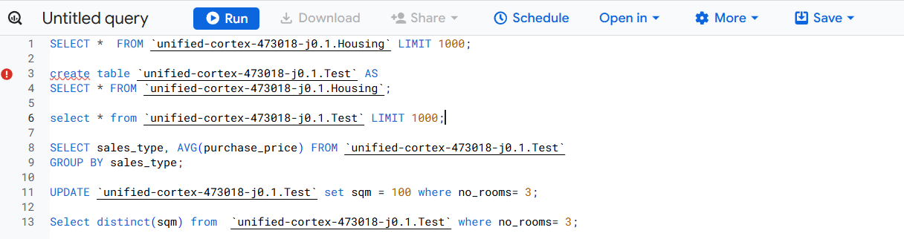
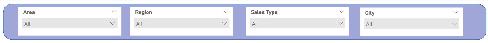
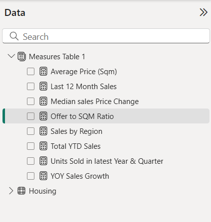
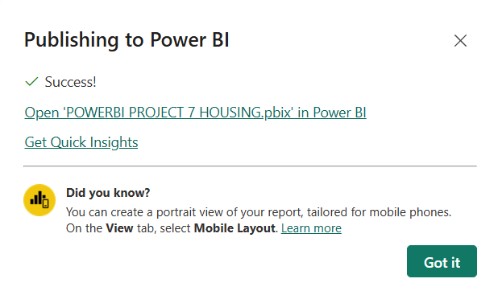
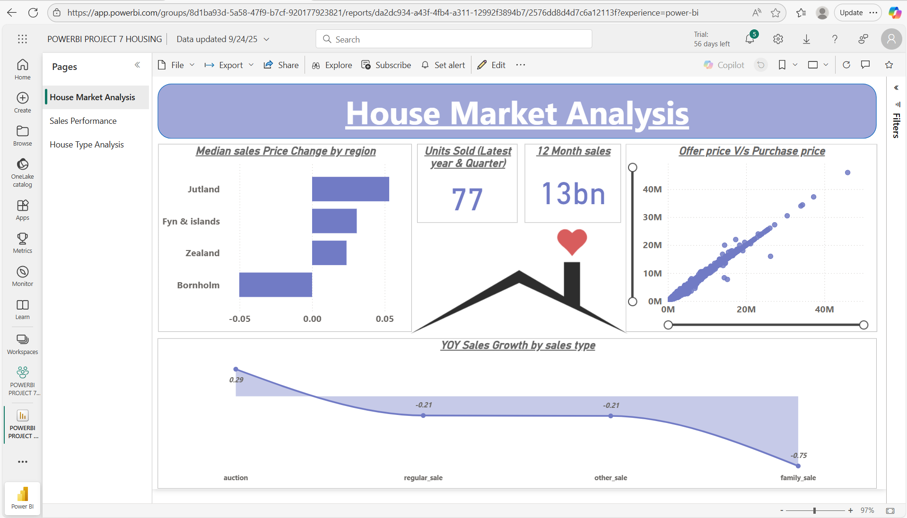
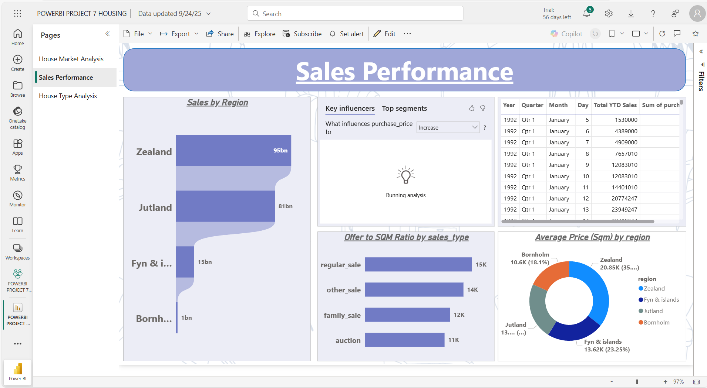

# Housing-Dashboard (Datasource: Google BigQuery)

### Dashboard Link : https://app.powerbi.com/reportEmbed?reportId=da2dc934-a43f-4fb4-a311-12992f3894b7&autoAuth=true&ctid=4190cc35-fd93-4aa6-9817-c1121132f7e2

## Problem Statement

This dashboard provides a detailed analysis of the housing market, helping stakeholders understand sales trends, pricing behavior, and market dynamics across regions and house types. It enables monitoring of key metrics such as year-on-year sales growth, total units sold, sales performance by region, and variations between offer price and purchase price.

Through the visualizations, users can identify regions with positive or negative median price changes, track 12-month cumulative sales (valued at 13 billion), and evaluate the relationship between offered and purchased property prices. In addition, the report highlights sales performance across regions like Zealand, Jutland, Fyn & Islands, and Bornholm, with Zealand showing the strongest contribution (95 billion).

The dashboard also provides insights into house type performance, comparing average offer and purchase prices for farms, villas, townhouses, apartments, and summer houses. It incorporates financial indicators such as inflation, interest rates, and yield, which allow deeper understanding of housing affordability and investment returns.

Overall, this analysis helps stakeholders make informed decisions about investment opportunities, pricing strategies, and policy planning in the housing sector. By identifying underperforming sales types, such as family sales with negative growth, and high-value markets like Zealand with premium per-square-meter pricing, the dashboard enables more data-driven strategies to optimize housing market outcomes.


### Steps followed 

- Step 1 : Data was loaded into Google BigQuery from CSV files, and schema auto-detection was enabled. Data integrity was verified using SQL queries before connecting Power BI Desktop to BigQuery through Import mode for efficient modeling.

- Step 2 : Power Query Editor was used for detailed data profiling. Column distribution, column quality, and column profiling were enabled based on the entire dataset. Missing values were identified and handled: nulls in the City column were replaced with "Unknown", missing Annual Inflation Rate was filled with 1.85%, and missing Yield on Mortgage Credit Bonds was filled with 1.47%.
- Step 3 : Data types were standardized across all columns, ensuring consistency in numeric, date, and text fields. Additional SQL transformations were performed in BigQuery to clean and validate values, such as correcting SQM data for properties with three rooms.
- Step 4 : In the report view, a professional theme was applied. Visual filters (slicers) were added for Area, Region, City, and Sales Type, enabling interactive drill-downs.

- Step5 : Several DAX measures were created to support calculations.

**YOY Sales Growth**:
```DAX
  YOY Sales Growth = 
  Var Current_year_sales = CALCULATE(SUM('Housing'[purchase_price]), YEAR('Housing'[date])= YEAR(MAX('Housing'[date]))) 
  Var Previous_year_sales = CALCULATE(SUM('Housing'[purchase_price]), YEAR('Housing'[date])= YEAR(MAX('Housing'[date]))-1)
  Return 
  IF(Previous_year_sales<>0, (Current_year_sales-Previous_year_sales)/Previous_year_sales, BLANK())
  ```

**Units Sold (Latest Year and Quarter)**:
  ```DAX
Units Sold in latest Year & Quarter = 
CALCULATE(DISTINCTCOUNT('Housing'[house_id]),
YEAR('Housing'[date])= YEAR(MAX('Housing'[date])) && QUARTER('Housing'[date])= QUARTER(MAX('Housing'[date])))
```
**12 Month Sales**:
  ```DAX
Last 12 Month Sales = 
CALCULATE(SUM('Housing'[purchase_price]), DATESINPERIOD('Housing'[date], MAX('Housing'[date]), -12, MONTH))
```
**Total YTD Sales**:
  ```DAX
Total YTD Sales = 
TOTALYTD(SUM('Housing'[purchase_price]), 'Housing'[date].[Date])
```
**Median Sales Price Change by Region**:
  ```DAX
Median sales Price Change = 
Var curr_median_price= MEDIANX(FILTER('Housing', YEAR('Housing'[date].[Date]) = YEAR(MAX('Housing'[date].[Date]))), 'Housing'[purchase_price])
Var prev_median_price= MEDIANX(FILTER('Housing', YEAR('Housing'[date].[Date])= YEAR(MAX('Housing'[date].[Date]))-1), 'Housing'[purchase_price])

Return IF(prev_median_price<>0, (curr_median_price- prev_median_price)/prev_median_price, BLANK())
```
**Offer to SQM Ratio**:
  ```DAX
Offer to SQM Ratio = 
DIVIDE(SUM('Housing'[offer_price]), SUM('Housing'[sqm]))
```

- Step 6 : Page 1 – House Market Analysis focused on providing a high-level overview of market dynamics. A bar chart was included to represent Median Sales Price Change by Region, which helps compare property price shifts across different regions and highlights areas experiencing growth or decline. A scatter plot was used to analyze the relationship between Offer Price and Purchase Price, enabling stakeholders to understand negotiation gaps and whether offers align with final transactions. A line chart was added to display Year-on-Year Sales Growth by Sales Type, which is crucial for identifying sales patterns and trends across time. Finally, card visuals were used to display Units Sold and 12-Month Sales, giving a quick snapshot of key performance indicators such as total volume and revenue over the most recent period.
- Step 7 : Page 2 – Sales Performance provided a deeper dive into regional and temporal performance. A bar chart was used to show Total Sales by Region, which makes it easier to compare sales contributions across geographical areas and identify the strongest and weakest performing regions. The Key Influencer Analysis was used for Purchase Price, allowing the dashboard to identify which factors—such as property age or region—had the most significant impact on housing prices. A table visual was included to display Year, Quarter, Month, and YTD Sales, enabling users to drill into time-series sales data and analyze seasonality. A bar chart was added to represent the Offer to SQM Ratio by Sales Type, which illustrates how pricing per square meter varies across different types of transactions. Lastly, a donut chart was used to show Average Price per SQM by Region, providing an intuitive view of price distribution across regions.
- Step 8 :Page 3 – House Type Analysis was designed to compare different property categories. A clustered column chart was created to show the Average Offer Price versus Purchase Price by House Type, helping visualize negotiation differences between house types such as villas, apartments, and townhouses. A combo chart was introduced to represent both Average SQM and Price per SQM by House Type, which helps in understanding how property size influences price per square meter. Additionally, a bar chart was used to display Inflation, Interest Rate, and Yield by House Type, highlighting the financial metrics associated with each property type and showing how economic indicators affect housing affordability and investment value.
- Step 9 : A dedicated Measures Table was created in Power BI to centralize all DAX measures. This ensured that all calculations, such as year-on-year sales growth, offer-to-SQM ratio, and total YTD sales, were well organized, reusable, and easy to maintain during report development.


- Step 10 : Styling consistency was carefully maintained across the report by applying predefined hex color codes, using uniform fonts, and adding borders, shadows, and transparency adjustments. These design choices enhanced readability, improved the professional look of the report, and ensured that the dashboard followed a coherent visual identity.
- Step 11 : The finalized report was published to the Power BI Service under Housing Project. Before deployment, all interactions across slicers and filters were validated to confirm smooth navigation.


# Snapshot of Dashboard (Power BI Service)

 





 

## Insights  

A multi-page report was created in Power BI Desktop and then published to Power BI Service. The following inferences can be drawn from the Housing Dashboard:  

### 1. Sales Volume and Market Trends  
The total number of units sold in the latest year and quarter was **77**, and the sales in the past 12 months amounted to **13 billion**. When analyzing *Year-on-Year Sales Growth by Sales Type*, auction sales showed positive growth at **0.29**, while regular sales and other sales both declined by **-0.21**. Family sales performed the weakest, showing a decline of **-0.75**. This indicates that auction-based transactions are currently gaining momentum, whereas traditional family sales are losing strength.  

### 2. Regional Market Performance  
Sales performance varies significantly across regions. **Zealand** emerged as the strongest market, contributing **95 billion**, followed by **Jutland** at **81 billion**. **Fyn & Islands** contributed **15 billion**, and **Bornholm** showed the weakest performance with only **1 billion**. The *Median Sales Price Change by Region* further highlighted that Jutland showed the highest growth, while Bornholm experienced a decline. This suggests Zealand dominates the market in total volume, but Jutland is showing stronger pricing momentum.  

### 3. Pricing Dynamics  
The scatter plot of *Offer Price vs Purchase Price* revealed a close alignment between the two, indicating that negotiation differences between offer and purchase prices remain limited across transactions. The *Offer to SQM Ratio by Sales Type* showed that regular sales had the highest ratio at **15K**, followed by other sales at **14K**, family sales at **12K**, and auctions at **11K**. This suggests that while auction sales are growing in volume, they still generate the lowest value per square meter.  

### 4. Regional Pricing Per Square Meter  
The *Average Price per SQM by Region* indicated that **Zealand** had the highest average at **20.85K (35%)**, followed by **Fyn & Islands** at **13.62K (23.25%)**, **Jutland** at **13K**, and **Bornholm** at **10.6K (18.1%)**. This highlights Zealand’s premium positioning in the market, both in sales value and per-square-meter pricing.  

### 5. House Type Analysis  
When analyzing by house type, **farms** had the highest average offer and purchase prices at **2.7M**, while **summer houses** had the lowest at **1.2M**. The *Average SQM and SQM Price by House Type* revealed that farms and villas had the largest property sizes, but apartments showed the highest SQM price at **28.7K**, reflecting premium pricing for smaller units. The financial indicators panel showed that farms delivered the highest yield at **4.6%**, while summer houses offered the lowest at **3.8%**. This indicates apartments are attractive for investors due to high per-square-meter returns, while farms balance both size and yield.  
